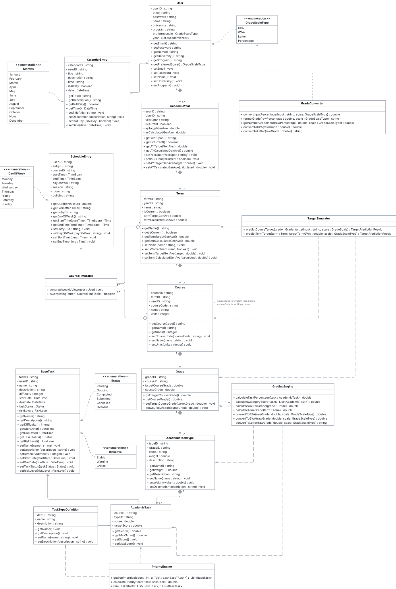

<p align="center">
   <a href="https://github.com/whiteSHADOW1234/TypingSVG">
   </a>
</p>


<div align="center">
   
   
   
   
   
   
</div>

  ‎  
# 📌 Overview

‎ ‎ ‎ ‎ **Acadeño** is a priority-based "Academic Command Center" designed to solve "Academic Fragmentation." Recognizing the overwhelming nature of modern education, it eliminates the need for students to juggle a calendar for their classes, a separate to-do list for their homework, and a messy Excel spreadsheet to guess their grades. By combining all of these into one unified, data-driven ecosystem, **Acadeño** goes far beyond a standard digital planner. It features a predictive logic engine that removes the guesswork from scheduling—automatically prioritizing tasks so students can manage their time effectively while maintaining a clear, real-time perspective on their academic performance.

  ‎  
# 🗺️ UML
<details>
  <summary>Show UML diagram</summary>
   <br>
      <div align="center">
         <a href="wwwroot/images/uml.svg" target="_blank">
            
         </a>
         <p><i>(Click the diagram to open in full-screen for high-resolution zoom)</i></p>
      </div>
</details>
   <br>

  ‎  
<h1 align="center">✨ Key Features and Functionalities ✨</h1>

‎ ‎ ‎ ‎ **Acadeño** isn't just a planner; it’s an interconnected ecosystem where every data point works together to optimize your academic workflow.

| | Module | Description & Capabilities |
| :- | :- | :- |
|🖥️|**Dashboard**<br>*(A centralized analytics hub)* | <ul><li>A digital clock and calendar integration.</li><li>Instant visibility of your current ***GWA/GPA*** and total units loaded.</li><li>An automated _Risk Level_ system to flag urgent academic tasks.</li></ul> |
|📚|**Course Management & Timetable** | <ul><li>Dynamic interfaces to manage subjects, schedules, and room locations, alongside integrated tracking for homework, activities, and exams.</li><li>A synchronized weekly timetable to visualize lecture and laboratory sessions.</li><li>Real-time tracking of individual subject performance.</li></ul> |
|🧮 |**Grade Simulator**<br>*("What-If" analysis tool)* | <ul><li>Input hypothetical scores for quizzes and exams to calculate final grade outcomes.</li><li>Monitor your Academic Standing through the built-in weighted mean calculator.</li></ul> |
|⚙️|**Priority Engine** | <ul><li>Automatically ranks tasks by combining deadline urgency with assignment value.</li></ul> |

  ‎  
<h1 align="center">⚙️ How The Program Works ⚙️</h1>

‎ ‎ ‎ ‎ Built on the cutting-edge .NET MAUI Blazor Hybrid framework, **Acadeño** delivers the best of both worlds: the sleek, responsive design of a modern web interface powered by the raw computational speed of a native C# Windows application. Because it relies on a local SQLite database, the entire system runs offline, ensuring lightning-fast performance and complete data privacy. 

‎ ‎ ‎ ‎ Acadeño is designed to be completely empty on first launch, allowing the user to construct a personalized academic environment from the ground up.

#### 01. Establish the Timeline
```bash
Navigate to settings to create your Academic Year and Term. Because Acadeño is strictly relational, nothing can exist without a timeframe. Setting this up first ensures all future tasks and courses are properly categorized and easily archived when the semester ends.
```

#### 02. Build the Syllabi
```bash
Go to the Courses Page to log your current subjects. Here, you don't just enter a course name; you define its DNA. Use the Syllabus Customizer to input the exact grading weights defined by your professor (e.g., Exams: 40%, Quizzes: 30%, Lab: 30%).
```

#### 03. Offload Your Brain
```bash
Switch to the Tasks Page to input your assignments. Enter your upcoming homework, projects, and test dates. You only need to provide the raw data (the due date and the course); the Priority Engine will instantly take over and rank them by urgency.
```

#### 04. Execute and Simulate
```bash
Return to the Dashboard for daily execution. Your Dashboard will now display a live, prioritized list of what needs your attention today. As the term progresses, jump into the Grade Simulator to safely test "What-If" scenarios and track your exact standing.
```

  ‎  
### 🏗️ The Architecture

‎ ‎ ‎ ‎ To ensure long-term scalability and maintainability, the application strictly adheres to Object-Oriented Programming (OOP) principles and a clear Separation of Concerns. By completely decoupling the visual UI layer from the underlying mathematical engines, the codebase remains modular, secure, and easy to navigate:

| Architecture Layer | Extension | Responsibility |
| :--- | :---: | :--- |
| **Logic Components** | <kbd>.razor</kbd> | The UI "Skeletons" that house structural HTML and reactive C# logic. |
| **CSS Isolation** | <kbd>.razor.css</kbd> | Scoped stylesheets that strictly apply to their parent component, preventing design leaks. |
| **The Backend Engine**| <kbd>.cs</kbd> | Pure C# classes that handle heavy mathematical lifting, database transactions, and logic. |

  ‎  
### 🧠 Core VIP Files

‎ ‎ ‎ ‎ Every application has a critical nervous system. The following files act as the foundational pillars of Acadeño, handling everything from database tracking to dependency injection. If you want to understand how the app boots up and routes data, start here:

| File / Module | Role | Core Responsibility |
| :--- | :--- | :--- |
| <kbd>AppDbContext.cs</kbd> | **The Bridge** | Connects directly to SQLite and handles all data persistence and entity tracking. |
| <kbd>MainLayout.razor</kbd> | **The Foundation** | Houses the persistent sidebar, top navigation, and main application frame. |
| <kbd>Routes.razor</kbd> | **The Traffic Cop** | Manages page routing, authorized views, and "Remember Me" session logic. |
| <kbd>MauiProgram.cs</kbd> | **The Blueprint** | The startup file where the application is "wired" together via Dependency Injection. |


  ‎  
<h1 align="center"> 🚀 How to Run the Application </h1>

‎ ‎ ‎ ‎ Getting Acadeño up and running on your local machine requires just a few commands in your terminal.

### Prerequisites

* **.NET 8.0 SDK or higher**
* **IDE (one of):** Visual Studio 2022 (with .NET MAUI workload), VS Code (with C# Dev Kit & MAUI extension)

#### 1. Clone the Repository

* **Using Command Prompt / Terminal:**
   ```bash
   git clone https://github.com/ennage/acadeno.git
   cd acadeno
   ```

#### 2. Build and Compile

* **Using Terminal:**
   ```bash
   dotnet restore
   dotnet build
   ```

#### 3. Run the Application

* **Using Terminal:**
   ```bash
   dotnet run -f net8.0-windows10.0.19041.0
   ```

  ‎  
## 👥 The Team

‎ ‎ ‎ ‎ Building an ecosystem as interconnected as Acadeño required a strict balance of clean UI architecture, complex mathematical logic, and dedicated project management. Meet the developers who brought this vision to life:

| Role | Name | Contribution | GitHub |
| :--- | :--- | :--- | :--- |
| **Project Manager** | **Calabia, Geanne Margaret** | Orchestrated project development, managed repository version control, and oversaw system architecture and database integration. | [@ennage](https://github.com/ennage) |
| **GUI Developer** | **Buenviaje, Lance** | Designed and implemented the **Graphical User Interface (GUI)** using Blazor, ensuring responsive layouts and an intuitive user experience. | [@LncBnvj](https://github.com/LncBnvj) |
| **Logic Developer & Tester** | **Aguilar, Azelle Ann** | Programmed the **backend C# logic and Priority Engine**, alongside executing comprehensive system debugging and quality assurance testing. | [@heeyzelnut](https://github.com/heeyzelnut) |

  ‎  
<h1 align="center">🌸 Acknowledgment 🌸</h1>

‎‎‎ ‎ ‎ ‎ We extend our sincere thanks to everyone who contributed to the success of **Acadeño**.


‎‎‎ ‎ ‎ ‎ We are especially grateful to our instructor, **Ms. Darlene Opeña**. From the proposal stage to the final build, she helped us focus our vision and pushed us to exceed our own expectations. Her honest feedback and continuous mentorship were vital to our success.


‎‎‎ ‎ ‎ ‎ To our teammates: thank you for your unwavering commitment and collaborative spirit. This project is a result of our shared hard work, and we couldn’t have done it without you.

— *The Acadeño Team* ✨